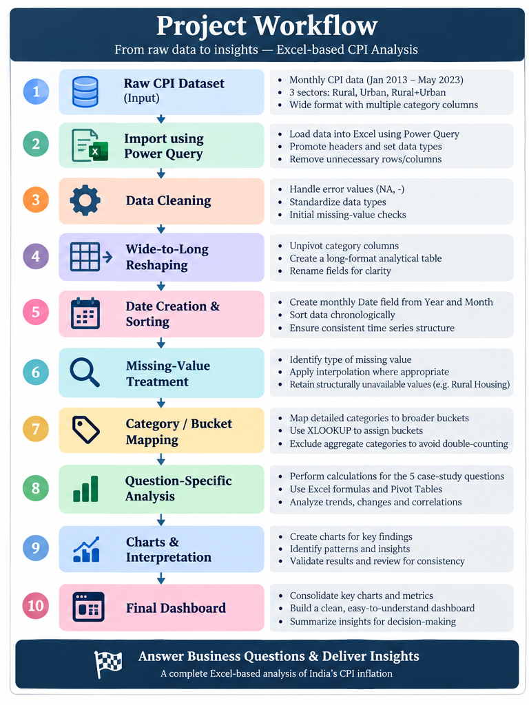
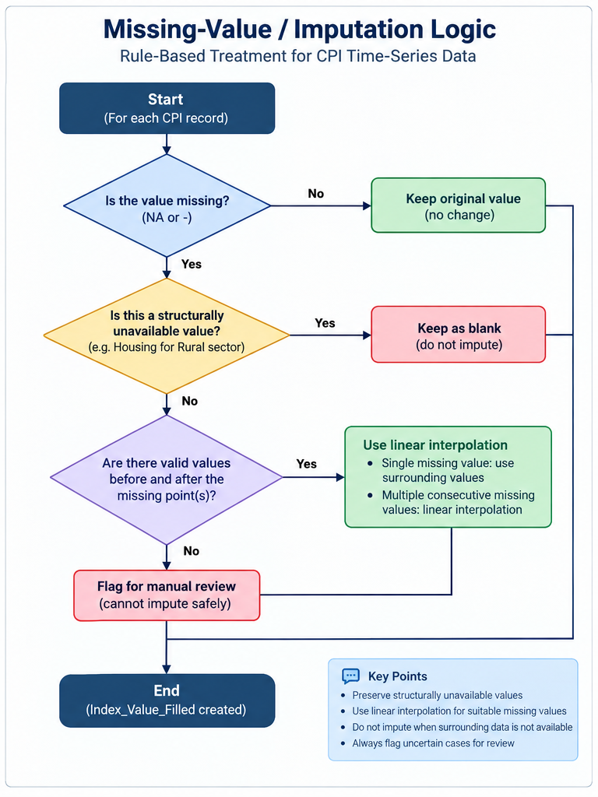
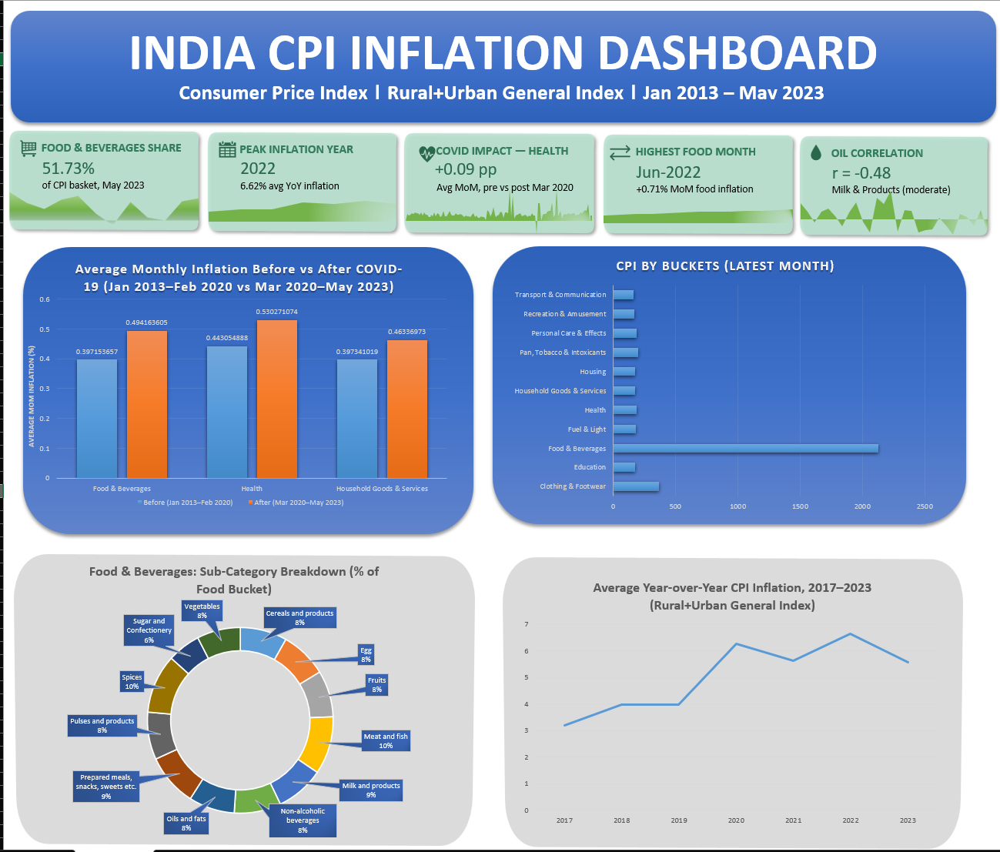

# India CPI Inflation Analysis — Excel Case Study

An end-to-end **Excel data analysis project** exploring India’s Consumer Price Index (CPI) from **January 2013 to May 2023** across Rural, Urban, and Rural+Urban sectors.

The project covers data transformation, missing-value treatment, category mapping, time-series inflation analysis, COVID-period comparison, crude-oil correlation analysis, and a final Excel dashboard.

**Project files:** [Excel Workbook](workbook/INDIA_CPI_PROJECT.xlsx) · [Raw CPI Dataset](data/RAW_DATA_All_India_Index_Upto_April23.csv)

## Project Highlights

| Analysis | Key Finding |
|---|---|
| CPI basket contribution | **Food & Beverages: 51.73%** of the analytical Rural+Urban basket in May 2023 |
| YoY inflation | **2022: ~6.62%**, the highest average YoY inflation in the 2017–2023 analysis |
| Food inflation | **June 2022: ~+0.71% MoM**, the highest month in the 12 months ending May 2023 |
| COVID comparison | **Health: ~+0.09 percentage points** higher average MoM inflation in the long pre/post comparison |
| Crude-oil correlation | **Milk & Products: r ≈ -0.48**, the largest relationship by absolute correlation |

> **Note:** The 2023 YoY figure is based only on data available through May 2023.

---

## Project Overview

The Consumer Price Index (CPI) tracks changes in the prices of goods and services consumed by households and is widely used as an indicator of inflation.

This case study analyzes historical India CPI data to understand **category contribution, inflation trends, food-price movement, COVID-era inflation behavior, and the relationship between imported crude-oil price changes and category-level inflation**.

The final deliverable is an Excel workbook containing the transformed analytical data, question-specific analysis, Pivot Tables, calculations, charts, and a consolidated dashboard.

---

## Business Problem & Objectives

The analysis was designed to answer five business questions:

1. **CPI Category Contribution** — Which broader consumption bucket contributed the most in the latest available month?
2. **Year-over-Year Inflation Trend** — How did Rural+Urban CPI inflation evolve from 2017 onward, and which year recorded the highest average YoY inflation?
3. **Food Inflation Analysis** — How did food inflation move during the 12 months ending May 2023, and which food sub-categories changed the most?
4. **COVID-19 Impact** — How did inflation behavior differ before and after March 2020 for selected categories?
5. **Imported Crude Oil vs CPI Inflation** — Which CPI categories showed the strongest relationships with monthly imported crude-oil price changes?

---

## Dataset

### CPI Dataset

The primary dataset contains monthly India CPI index values from **January 2013 to May 2023**.

- **372 sector-month records**
- **30 columns**
- **3 sectors:** Rural, Urban, Rural+Urban
- Original structure: **wide format**
- Includes detailed CPI categories as well as aggregate categories such as `Food and beverages`, `Clothing and footwear`, `Miscellaneous`, and `General index`
- Contains genuine missing observations as well as structurally unavailable values such as **Rural Housing**

Representative CPI categories include cereals, meat and fish, milk, oils and fats, fruits, vegetables, clothing, footwear, housing, fuel and light, health, education, transport and communication, and personal care.

### Analytical Data Structure

The CPI data was transformed into a long-format analytical table:

| Field | Purpose |
|---|---|
| `Sector` | Rural, Urban, or Rural+Urban |
| `Category` | CPI category being measured |
| `Index_Value` | Original CPI index value |
| `Date` | Monthly time dimension |
| `Index_Value_Filled` | CPI value after applicable missing-value treatment |
| `Buckets` | Broader analytical category assigned to detailed categories |

This structure made the data easier to filter, aggregate, compare across categories, and use in Pivot Tables and time-series calculations.

### Imported Crude-Oil Data

A second monthly dataset containing **India’s imported crude-oil prices in USD per barrel** was used for the crude-oil analysis.

Monthly oil-price changes were aligned with monthly CPI-category changes for the correlation analysis.

---

## Project Workflow

The project followed a structured Excel-based workflow from raw data preparation to final insight delivery.

---

## Data Preparation & Missing-Value Treatment

### Data Preparation

The raw CPI dataset was imported into Excel using **Power Query** and transformed into an analysis-ready structure.

The verified preparation steps included:

- promoting headers and assigning data types
- handling error and missing-value representations
- unpivoting CPI category columns from wide to long format
- renaming analytical fields
- creating a monthly `Date` field from Year and Month
- sorting the time series chronologically

The wide-to-long transformation converted many category columns into a single `Category` field with a corresponding `Index_Value`, making the data suitable for reusable filtering, Pivot Tables, bucket mapping, and time-series calculations.

### Missing-Value Treatment

Missing values were handled according to their meaning rather than through one blanket replacement rule.

1. **Structurally unavailable values** — Rural Housing observations were intentionally left blank.
2. **Existing observations** — valid original CPI values were retained unchanged.
3. **Isolated missing values** — surrounding valid observations were used to estimate the missing point.
4. **Consecutive short gaps** — values were estimated using **linear interpolation** when suitable valid observations existed around the gap.
5. **Unresolved cases** — observations that could not be safely estimated were flagged for manual review.

### Why Linear Interpolation?

CPI is a time-series index. Replacing missing observations with a general mean could ignore the local movement of the series.

Linear interpolation was used to preserve the progression between nearby known observations while keeping structurally unavailable data separate from genuinely missing values.

---

## Category / Bucket Mapping

A separate mapping table was created to group detailed CPI categories into broader analytical buckets such as:

- Food & Beverages
- Clothing & Footwear
- Housing
- Fuel & Light
- Health
- Education
- Household Goods & Services
- Transport & Communication
- Personal Care & Effects

The mapping was brought into the analytical CPI table using **`XLOOKUP`**, creating a reusable `Buckets` field.

### Avoiding Double-Counting

The source dataset already contains aggregate categories such as `Food and beverages`, `Clothing and footwear`, `Miscellaneous`, and `General index`.

These were marked as:

`Not Bucketed (Aggregate)`

rather than being assigned again to a broader bucket. This prevented an aggregate category from being counted together with its underlying components.

---

## Analysis Performed

### 1. CPI Contribution by Broader Buckets

**Objective:** Identify the broader category with the largest contribution in the latest available month.

**Method:** Detailed categories were mapped to broader buckets, and a Pivot Table was used to calculate each bucket as a **percentage of the total** for May 2023.

> **Result: Food & Beverages accounted for approximately 51.73% of the analytical Rural+Urban basket — the largest share among the broader buckets.**

**Interpretation:** The Food & Beverages bucket dominates under the case study’s equal-category framework. Its large share also reflects the number of detailed food categories included in the bucket.

---

### 2. Year-over-Year CPI Inflation Trend

**Objective:** Analyze overall Rural+Urban CPI inflation from 2017 onward and identify the year with the highest average YoY inflation.

**Method:** The **Rural+Urban General Index** was compared with the corresponding month 12 months earlier:

$$
\text{YoY Inflation (\%)} =
\frac{\text{Current CPI} - \text{CPI 12 Months Earlier}}
{\text{CPI 12 Months Earlier}}
\times 100
$$

Monthly YoY rates were then averaged by calendar year.

| Year | Average YoY Inflation |
|---|---:|
| 2017 | ~3.19% |
| 2018 | ~3.97% |
| 2019 | ~3.97% |
| 2020 | ~6.27% |
| 2021 | ~5.63% |
| **2022** | **~6.62%** |
| 2023* | ~5.58% |

> **Result: 2022 recorded the highest average YoY inflation at approximately 6.62%.**

\*2023 includes only the months available through May 2023.

---

### 3. Food Inflation Analysis

#### Monthly Food Inflation

**Method:** Month-over-Month food inflation was analyzed for the 12 months ending May 2023:

$$
\text{MoM Inflation (\%)} =
\frac{\text{Current Index} - \text{Previous Month Index}}
{\text{Previous Month Index}}
\times 100
$$

> **Highest:** June 2022 — approximately **+0.71%**  
> **Lowest:** December 2022 — approximately **-0.12%**

The series showed that short-term food inflation moved unevenly across the period rather than following a constant trend.

#### Food Sub-Category Change

Absolute index-point change was calculated between May 2022 and May 2023:

$$
\text{Absolute Change} =
\text{May 2023 CPI} - \text{May 2022 CPI}
$$

| Food Category | Approx. Change |
|---|---:|
| **Spices** | **+33.1** |
| Cereals and products | +19.6 |
| Milk and products | +14.6 |
| Vegetables | -13.9 |
| **Oils and fats** | **-32.4** |

> **Spices recorded the largest positive index-point increase, while Oils & Fats recorded the largest decline.**

---

### 4. COVID-19 Impact on Inflation

**Objective:** Compare inflation behavior around the onset of COVID-19 using **March 2020** as the reference point.

The analysis focused on:

- Food & Beverages
- Health
- Household Goods & Services

#### Long-Period Comparison

- **Before:** January 2013 – February 2020
- **After:** March 2020 – May 2023

| Category | Before | After |
|---|---:|---:|
| Food & Beverages | 0.397% | 0.494% |
| Health | 0.443% | 0.530% |
| Household Goods & Services | 0.397% | 0.464% |

> **Health increased by approximately +0.09 percentage points in average monthly inflation.**

#### Equal 12-Month Comparison

A second comparison used equal windows:

- **Pre-COVID:** March 2019 – February 2020
- **Post-COVID:** March 2020 – February 2021

The pre-COVID food period contained unusually high food-price movement in 2019, including the onion-price spike. Retaining both comparison windows helped show how **baseline selection can materially change a before/after conclusion**.

---

### 5. Imported Crude Oil Prices vs CPI Inflation

**Objective:** Examine whether monthly imported crude-oil price movements were associated with CPI-category inflation.

Oil prices and individual CPI categories were converted into Month-over-Month percentage changes. Excel’s **`CORREL`** function was then used to compare the monthly changes.

$$
\text{Oil MoM (\%)} =
\frac{\text{Current Oil Price} - \text{Previous Oil Price}}
{\text{Previous Oil Price}}
\times 100
$$

| CPI Category | Correlation with Oil-Price Change |
|---|---:|
| **Milk and products** | **~-0.48** |
| Education | ~-0.45 |
| Vegetables | ~-0.36 |
| Personal care and effects | ~-0.27 |
| Transport and communication | ~+0.27 |
| Oils and fats | ~+0.22 |
| Fuel and light | ~+0.19 |

> **Milk & Products showed the largest relationship by absolute correlation, at approximately -0.48.**

Scatter plots with trendlines were also used in the workbook to inspect selected relationships visually.

The coefficients were generally moderate or weak, indicating association rather than a single dominant relationship across CPI categories. **Correlation does not establish causation.**

---

## Final Dashboard

The final Excel dashboard consolidates the major findings from the five analysis areas into a single view.

---

## Key Insights

- **Food & Beverages** was the largest broader bucket at **51.73%** of the analytical Rural+Urban basket in May 2023.
- **2022** recorded the highest average YoY CPI inflation at approximately **6.62%**.
- Food inflation peaked at approximately **+0.71% MoM in June 2022** and reached its lowest point at approximately **-0.12% in December 2022**.
- **Spices (+33.1)** recorded the largest positive May-to-May food index change; **Oils & Fats (-32.4)** recorded the largest decline.
- Average monthly inflation was higher after March 2020 for the three selected categories in the long-period COVID comparison.
- The COVID analysis demonstrated that **baseline selection matters**, especially when the pre-period contains unusual price shocks.
- Crude-oil relationships varied by category; the strongest absolute correlation observed was **Milk & Products at approximately -0.48**.
- Oil-price correlation results were generally moderate or weak and should not be interpreted as causal effects.

---

## Tools & Technologies

- **Microsoft Excel** — primary analysis and dashboard environment
- **Power Query** — import, cleaning, reshaping, and transformation
- **Pivot Tables** — aggregation and contribution analysis
- **Excel Data Model / Power Pivot** — workbook modelling infrastructure
- **Excel Charts** — trend, comparison, contribution, and scatter visualizations
- **Excel formulas** — calculation, interpolation, mapping, and analysis
- **Correlation Analysis** — category-level comparison with imported crude-oil changes

**Key functions:** `XLOOKUP`, `IF`, `IFS`, `ISBLANK`, `AVERAGE`, `AVERAGEIFS`, `EDATE`, `MAX`, `MIN`, `CORREL`

> No DAX measures were used in the analysis documented here.

---

## Challenges & Analytical Considerations

| Consideration | Why It Matters |
|---|---|
| **CPI is an index** | CPI values were not summed across months; percentage changes and comparisons were used instead. |
| **Equal-category treatment** | The bucket contribution follows the case-study requirement and is not an official expenditure-weighted CPI contribution. |
| **Rural Housing is structurally unavailable** | These observations were intentionally left blank rather than imputed. |
| **Interpolation has limitations** | Linear interpolation preserves local progression but can smooth genuine short-term shocks. |
| **2023 is partial-year** | The 2023 YoY average uses only data available through May 2023. |
| **COVID baseline sensitivity** | Different pre/post windows can produce different interpretations. |
| **Correlation ≠ causation** | The oil analysis measures association only. |
| **No lagged oil analysis** | The project compares contemporaneous monthly changes and does not test delayed pass-through effects. |

---

## Conclusion

This project demonstrates an end-to-end **Excel-based data analysis workflow** covering data preparation, missing-value treatment, category mapping, time-series inflation calculations, Pivot Table analysis, correlation analysis, visualization, and dashboard development.

The project translates historical CPI data into structured findings on category contribution, annual inflation, food-price movement, COVID-era inflation, and crude-oil relationships while explicitly documenting key assumptions and analytical limitations.
